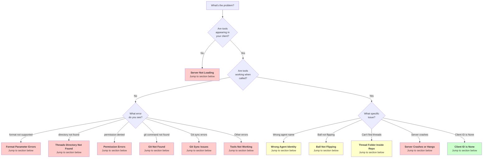

# Watercooler MCP Server - Troubleshooting Guide

Common issues and solutions for the watercooler MCP server.

> Replace any repo-local thread folders with your actual threads repository (for example, the sibling `../<repo>-threads` directory).

> 📘 Start with [SETUP_AND_QUICKSTART.md](SETUP_AND_QUICKSTART.md) to ensure you're following the universal flow. Many issues disappear once `code_path` and identity are configured there.

## Table of Contents

- [Quick Diagnostic Flowchart](#quick-diagnostic-flowchart)
- [Quick Health Check](#quick-health-check)
- [Common Issues](#common-issues)
  - [Server Not Loading](#server-not-loading)
  - [Wrong Agent Identity](#wrong-agent-identity)
  - [Threads Directory Not Found](#threads-directory-not-found)
  - [Permission Errors](#permission-errors)
  - [Client ID is None](#client-id-is-none)
  - [Tools Not Working](#tools-not-working)
  - [Git Not Found](#git-not-found)
  - [Git Sync Issues (Cloud Mode)](#git-sync-issues-cloud-mode)
- [Thread folder inside code repo](#thread-folder-inside-code-repo)
- [Ball Not Flipping](#ball-not-flipping)
- [Server Crashes or Hangs](#server-crashes-or-hangs)
- [Format Parameter Errors](#format-parameter-errors)
- [401 Unauthorized (Remote MCP)](#401-unauthorized-remote-mcp)
- [Getting More Help](#getting-more-help)

---

## Quick Diagnostic Flowchart

Use this decision tree to quickly find the solution to your problem:



**Legend:**
- 🔴 Red boxes: Critical issues preventing basic functionality
- 🟡 Yellow boxes: Configuration issues affecting behavior
- 🟢 Green boxes: Informational (not actually a problem)

---

## Quick Health Check

Before diving into specific issues, always start with the health check:

```bash
# In your MCP client, call:
watercooler_v1_health
```

This returns:
- ✅ Server version
- ✅ Agent identity
- ✅ Threads directory location
- ✅ Directory existence status
- ✅ Python version
- ✅ FastMCP version

**Use this output when reporting issues!**

---

## Common Issues

## Server Not Loading

### Symptom
MCP tools don't appear in your client (Claude Desktop, Claude Code, Codex).

### Solutions

1. **Verify installation**
   ```bash
   python3 -m watercooler_mcp
   ```
   Should display FastMCP banner and start server.

2. **Check configuration file syntax**
   - **Codex**: Verify `~/.codex/config.toml` is valid TOML
   - **Claude Desktop**: Verify `claude_desktop_config.json` is valid JSON
   - **Claude Code**: Verify `.mcp.json` is valid JSON

3. **Restart your client**
   - Codex: Restart the CLI session
   - Claude Desktop: Quit and relaunch the app
   - Claude Code: Reload window (Cmd+R or Ctrl+R)

4. **Check Python path**
   ```bash
   which python3
   ```
   Ensure the `python3` in your config matches your installation.

5. **Verify dependencies**
   ```bash
   pip list | grep -E "(fastmcp|mcp)"
   ```
   Should show `fastmcp>=2.0` and `mcp>=1.0`.

## Wrong Agent Identity

### Symptom
`watercooler_v1_whoami` shows incorrect or unexpected agent name.

### Solutions

1. **Use identity tool before writing**
   Call `watercooler_v1_set_agent(base="Claude Code", spec="implementer-code")` before any write operations (say, ack, handoff, set_status).

2. **Alternative: Use agent_func parameter**
   Supply `agent_func="<platform>:<model>:<role>"` on each write call (e.g., `"Claude Code:sonnet-4:implementer"`).

3. **Client ID auto-detection**
   - "Claude Desktop" → "Claude"
   - "Claude Code" → "Claude Code"
   - "Codex" → "Codex"
   - "Cursor" → "Cursor"
   - Other values passed through as-is

See [STRUCTURED_ENTRIES.md](STRUCTURED_ENTRIES.md#identity-pre-flight) for complete identity requirements.

## Threads Directory Not Found

### Symptom
```
No threads directory found at: /some/path/threads-local
```

### Solutions

1. **Confirm `code_path` is present**
   - Every tool call must include `code_path` (e.g., `"."`) so the server can resolve the repo/branch
   - Missing `code_path` is the most common cause of this error in universal mode

2. **Check the health output**
   ```bash
   watercooler_v1_health(code_path=".")
   ```
   Expect `Threads Dir` to live in the sibling `<repo>-threads` directory (e.g., `/workspace/<repo>-threads`)

3. **Remove manual overrides**
   - Unset `WATERCOOLER_DIR` in your environment or MCP config
   - Re-register the MCP server using the universal command in `SETUP_AND_QUICKSTART.md`

4. **Ensure git metadata is available**
   - `code_path` must point to a git repository with a configured `origin`
   - If the repo is detached (no remote), set `WATERCOOLER_CODE_REPO` manually or add a remote

5. **Advanced: force a directory**
   - If you intentionally need a bespoke location, set `WATERCOOLER_DIR` to an absolute path and create it ahead of time
   - Remember this disables universal discovery—use sparingly

## Permission Errors

### Symptom
```
PermissionError: [Errno 13] Permission denied: '/workspace/<repo>-threads/thread.md'
```

### Solutions

1. **Check directory permissions**
   ```bash
   THREADS_DIR="../<repo>-threads"
   ls -la "$THREADS_DIR"
   ```

   Should be writable by your user:
   ```bash
   chmod 755 "$THREADS_DIR"
   ```

2. **Check file permissions**
   ```bash
   chmod 644 "$THREADS_DIR"/*.md
   ```

3. **Verify ownership**
   ```bash
   chown -R "$USER" "$THREADS_DIR"
   ```

## Client ID is None

### Symptom
`watercooler_v1_whoami` shows `Client ID: None`

### Explanation
This is **normal for local STDIO connections**. The `client_id` is:
- Populated when using OAuth authentication (FastMCP Cloud)
- `None` for local STDIO transport (Claude Desktop, Claude Code, Codex)

### Solutions

1. **For local usage**: This is expected and doesn't affect functionality
   - Agent identity is set via `watercooler_v1_set_agent` tool or `agent_func` parameter
   - Everything works normally

2. **For multi-tenant cloud deployment**: Configure OAuth provider
   - See [L5_MCP_PLAN.md](../L5_MCP_PLAN.md) Phase 2
   - Requires GitHub, Google, WorkOS, Auth0, or Azure OAuth

## Tools Not Working

### Symptom
Tool calls fail or return errors.

### Solutions

1. **Check tool name**
   All tools are namespaced: `watercooler_v1_*`

   ✅ Correct:
   ```
   watercooler_v1_list_threads
   watercooler_v1_say
   ```

   ❌ Incorrect:
   ```
   list_threads
   say
   ```

2. **Verify tool availability**
   Check your client's tool list:
   - Should show 9 tools total
   - All prefixed with `watercooler_v1_`

3. **Check parameters**
   Each tool has required parameters. Example:
   ```
   watercooler_v1_say(
       topic="required",
       title="required",
       body="required"
   )
   ```

4. **Review error message**
   Error messages include helpful context:
   ```
   Error adding entry to 'topic': [specific error]
   ```

## Git Not Found

### Symptom
```
FileNotFoundError: git command not found
```

### Solutions

1. **Install git**
   ```bash
   # macOS
   brew install git

   # Linux
   sudo apt-get install git
   ```

2. **Verify git in PATH**
   ```bash
   which git
   git --version
   ```

3. **Fallback behavior**
   If git is not available:
   - Upward search stops at HOME directory

## Git Authentication

### Symptom
Git pushes/pulls fail, or you see `Permission denied (publickey)` / `fatal: Authentication failed` errors.

### Solutions

1. **Verify credentials file**
   - Check that `~/.watercooler/credentials.json` exists
   - File should contain `{"github_token": "ghp_..."}`
   - File permissions should be 0600 (Unix/Mac) for security

2. **Re-authenticate via dashboard**
   - Visit [Watercooler Dashboard](https://watercooler.mostlyharmless.ai)
   - Sign in with GitHub
   - Download fresh credentials file from Settings → GitHub Connection
   - Replace `~/.watercooler/credentials.json`

3. **Verify git credential helper**
   - The MCP server automatically configures the git credential helper
   - Test manually: `echo "protocol=https\nhost=github.com\n" | git credential fill`
   - Should return your token

4. **Check token permissions**
   - Token must have `repo` scope for private repositories
   - Visit GitHub Settings → Developer settings → Personal access tokens
   - Regenerate token if scopes are incorrect

5. **SSH alternative (advanced)**
   - If you prefer SSH over HTTPS, ensure your SSH keys are configured
   - Verify with: `ssh -T git@github.com`
   - The credential helper will still be used for HTTPS operations

See [AUTHENTICATION.md](AUTHENTICATION.md) for complete authentication guide.

---

## Stale MCP Server Processes

If you interrupt the MCP server with CTRL-C, background processes may linger as orphaned daemons. This can cause issues with code updates not taking effect.

### Symptom
- Code changes don't take effect despite restarting client
- Multiple watercooler MCP processes running
- Unexpected behavior after updates

### Check for Stale Processes

```bash
./check-mcp-servers.sh
```

This warns about processes older than 1 hour.

### Clean Up Stale Processes

```bash
./cleanup-mcp-servers.sh
```

The cleanup script shows all watercooler MCP processes and prompts for confirmation before killing them.

### Manual Cleanup

```bash
# Kill all watercooler MCP processes
pkill -f watercooler_mcp

# Or kill specific PIDs
ps aux | grep watercooler_mcp
kill <PID>
```

**After cleanup:** Restart Claude Code (or your MCP client) to reconnect with fresh server processes.

---

## Git Sync Issues (Cloud Mode)

If you enabled cloud sync via `WATERCOOLER_GIT_REPO`, here are common problems and fixes:

- Authentication failed
  - Ensure the deploy key/token has access to the repo
  - If using SSH: verify `WATERCOOLER_GIT_SSH_KEY` path is correct; add key to agent/known_hosts if required

- Rebase in progress / cannot pull
  - A previous `git pull --rebase` may have left the repo in an in-progress state
  - Fix: run `git rebase --abort` in the threads repo directory, then retry

- Push rejected (non-fast-forward)
  - Another agent pushed first; this is expected under concurrency
  - Fix: pull (`git pull --rebase --autostash`) and retry push

- Staged unrelated files
  - If the threads dir is co-located with other project files, `git add -A` may stage unrelated files
  - Fix: move templates/indexes into the sibling `<repo>-threads` repository before staging

- Stale content after Worker cache
  - If using Cloudflare Worker + R2, ensure cache keys include a version/commit SHA and are invalidated/rotated on write

- Rate limits / GitHub API
  - Apply exponential backoff and consider short batching windows
   - All other functionality works normally

## Thread folder inside code repo

### Symptom
Server resolves threads inside the code repository instead of the sibling `<repo>-threads` directory.

### Solutions

1. **Confirm universal location**
   ```bash
   watercooler_v1_health(code_path=".")
   ```
   Check the `Threads Dir` line (should be the sibling `<repo>-threads` path).

2. **Move stray data**
   ```bash
   THREADS_DIR="../<repo>-threads"
   mkdir -p "$THREADS_DIR"

   # Replace STRAY_DIR with the actual repo-local folder you discovered
   STRAY_DIR="./threads-local"
   if [ -d "$STRAY_DIR" ]; then
     rsync -av --remove-source-files "$STRAY_DIR"/ "$THREADS_DIR"/
     rm -rf "$STRAY_DIR"
   fi
   ```

3. **Remove manual overrides**
   - Delete any `WATERCOOLER_DIR` overrides unless you intentionally need them.
   - Re-register the MCP server following `SETUP_AND_QUICKSTART.md`.

## Ball Not Flipping

### Symptom
`watercooler_v1_say` doesn't flip the ball to counterpart.

### Solutions

1. **Check agents.json configuration**
   ```bash
   THREADS_DIR="../<repo>-threads"
   cat "$THREADS_DIR"/agents.json
   ```

   Should define counterparts:
   ```json
   {
     "agents": {
       "Claude": {"counterpart": "Codex"},
       "Codex": {"counterpart": "Claude"}
     }
   }
   ```

2. **Create agents.json if missing**
   See [docs/archive/integration.md](./archive/integration.md) for configuration guide.

3. **Verify with read_thread**
   ```
   watercooler_v1_read_thread(topic="your-topic")
   ```
   Check `Ball:` line in output.

## Server Crashes or Hangs

### Symptom
MCP server stops responding or crashes.

### Solutions

1. **Check server logs**
   - Codex: Check terminal output
   - Claude Desktop: Check console logs
   - Claude Code: Check Developer Console

2. **Verify Python version**
   ```bash
   python3 --version
   ```
   Required: Python 3.10 or later

3. **Update dependencies**
   ```bash
   pip install -e .[mcp] --upgrade
   ```

4. **Test server directly**
   ```bash
   python3 -m watercooler_mcp
   ```
   Should start without errors.

## Format Parameter Errors

### Symptom
```
Error: Only format='markdown' is currently supported
```

### Explanation
Currently only markdown output is supported. JSON support is a deferred feature (see [ROADMAP.md](../ROADMAP.md)).

### Solutions

1. **Use markdown format (default)**
   ```
   watercooler_v1_list_threads()
   # or explicitly
   watercooler_v1_list_threads(format="markdown")
   ```

2. **Check ROADMAP.md for status**
JSON support will be implemented if real-world usage demonstrates the need.

## 401 Unauthorized (Remote MCP)

> Applies only to the archived remote/worker deployment. Local stdio mode does **not** use OAuth.

### Symptom
- Client shows "Unauthorized - No session" or cannot open `/sse`
- FastMCP logs report `401 Unauthorized`

### Causes
- No OAuth cookie session or bearer token when hitting the worker endpoint
- Attempted `?session=dev` while the dev session toggle is disabled (default in staging/production)

### Solutions
1. **Browser session:** visit `/auth/login` on the worker (CLI should pop it open) to complete OAuth.
2. **Headless/token:** visit `/console` on the worker to generate a personal token, then connect with `Authorization: Bearer <token>`.
3. **Dev session (only for testing):** set `ALLOW_DEV_SESSION="true"` on the worker and reconnect with `?session=dev`. Never enable this in production.

### Verification
- `watercooler_v1_whoami` returns a non-null `user_id` and `project_id`
- Worker logs contain `session_validated` entries

## Getting More Help

### 1. Run Diagnostic Tools

**Health Check:**
```bash
# In your MCP client:
watercooler_v1_health
```

Returns comprehensive diagnostics:
- ✅ Server version
- ✅ Agent identity
- ✅ Threads directory location
- ✅ Directory existence
- ✅ Python executable
- ✅ FastMCP version

**Identity Check:**
```bash
# In your MCP client:
watercooler_v1_whoami
```

Returns:
- Your agent name
- Client ID (if available)
- Session ID

### 2. Enable Verbose Logging

Run server directly to see detailed output:

```bash
# Test server startup
python3 -m watercooler_mcp

# Should display:
# ===== FastMCP Server =====
# Server: watercooler-mcp
# ...
```

### 3. Check Documentation

Still stuck? Review these guides:

- **[Quickstart Guide](./QUICKSTART.md)** - Step-by-step setup instructions
- **[Environment Variables](./ENVIRONMENT_VARS.md)** - Complete configuration reference
- **[Cloud Sync Guide](../.mothballed/docs/CLOUD_SYNC_GUIDE.md)** - Git sync setup and troubleshooting
- **[MCP Server Guide](./mcp-server.md)** - Tool reference and usage examples
- **[Claude Code Setup](./archive/CLAUDE_CODE_SETUP.md)** - Claude Code specific configuration
- **[Claude Desktop Setup](./archive/CLAUDE_DESKTOP_SETUP.md)** - Claude Desktop specific configuration

### 4. Report Issues

If you encounter a bug, open an issue with:

**Required Information:**
1. ✅ Output from `watercooler_v1_health`
2. ✅ Your MCP configuration (sanitized - remove secrets!)
3. ✅ Error messages and stack traces
4. ✅ Steps to reproduce

**Optional but Helpful:**
- Operating system and version
- Python version (`python3 --version`)
- FastMCP version (`pip show fastmcp`)
- Whether using local or cloud mode

**Where to Report:**
- GitHub Issues: https://github.com/mostlyharmless-ai/watercooler-cloud/issues

---

## Quick Reference: Diagnostic Commands

| Problem | Command | What to Look For |
|---------|---------|-----------------|
| Server not loading | `python3 -m watercooler_mcp` | FastMCP banner appears? |
| Wrong agent | `watercooler_v1_whoami` | Agent name matches config? |
| Wrong directory | `watercooler_v1_health` | Threads Dir path correct? |
| Git issues | `which git && git --version` | Git installed and in PATH? |
| Python issues | `python3 --version` | Python 3.10 or later? |
| Package issues | `pip list \| grep -E "(fastmcp\|mcp)"` | fastmcp>=2.0 installed? |

---

**Still having trouble?** Open an issue with the diagnostic information above. We're here to help!
### 401 Unauthorized (cloud Remote MCP)

Symptoms
- Client shows "Unauthorized - No session" or cannot open `/sse`.

Causes
- No OAuth cookie session (browser flow not completed) and no Bearer token provided.
- Attempted `?session=dev` while dev session is disabled (default for staging and always in production).

Fix
- OAuth: Visit `/auth/login` on the Worker to authenticate (browser popup from client, or open manually).
- Token (CLI/headless): Visit `/console` to issue a personal token, then connect with header `Authorization: Bearer <token>`.
- Staging: Only if absolutely necessary for testing, set `ALLOW_DEV_SESSION="true"` (never in production) and reconnect with `?session=dev`.

Verification
- `whoami` tool shows your `user_id` and current `project_id`.
- Worker logs contain `session_validated` events.
